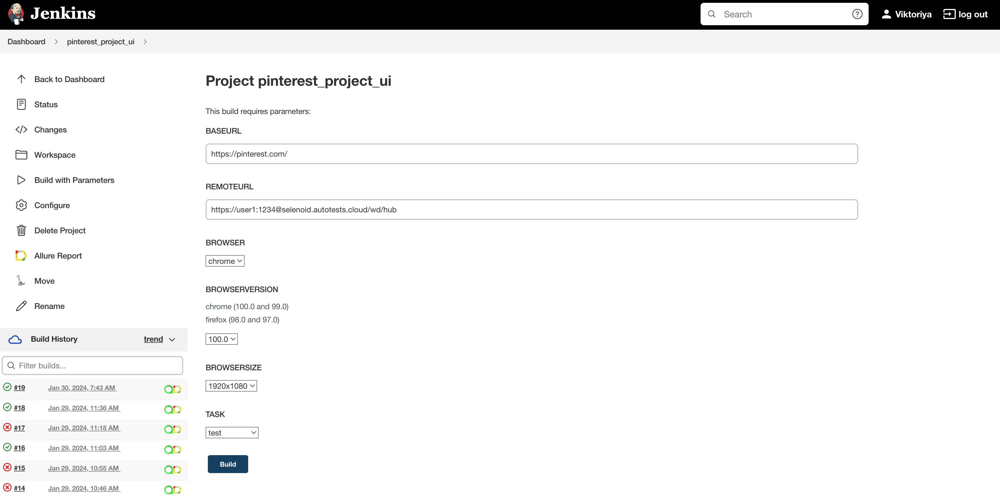
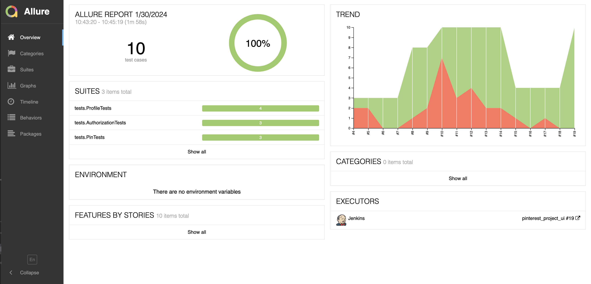
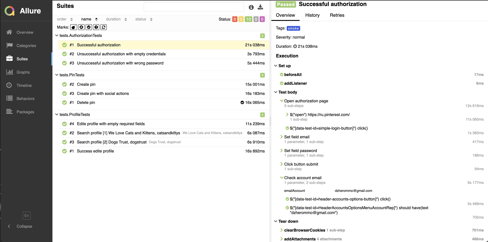
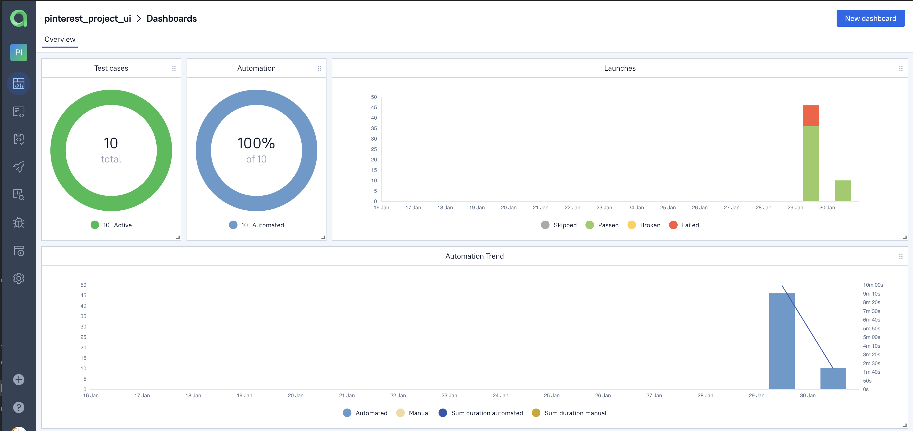
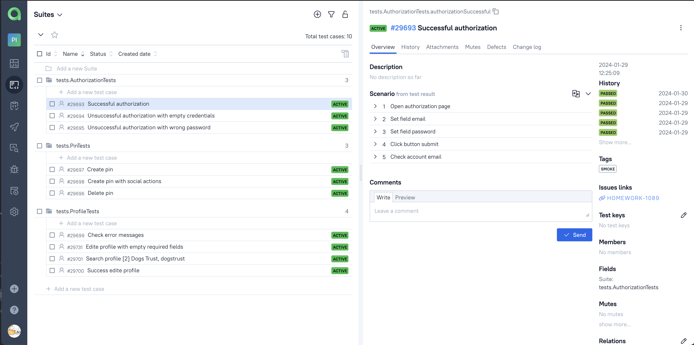
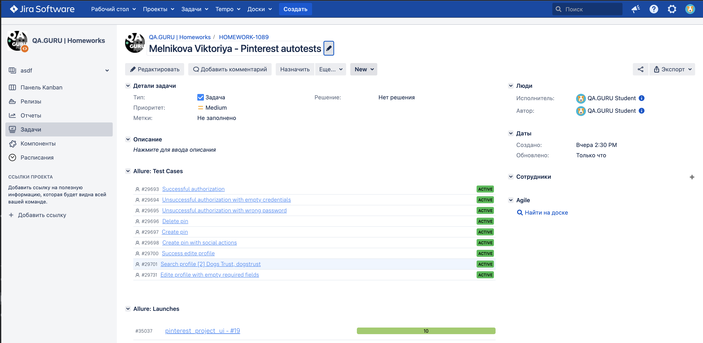
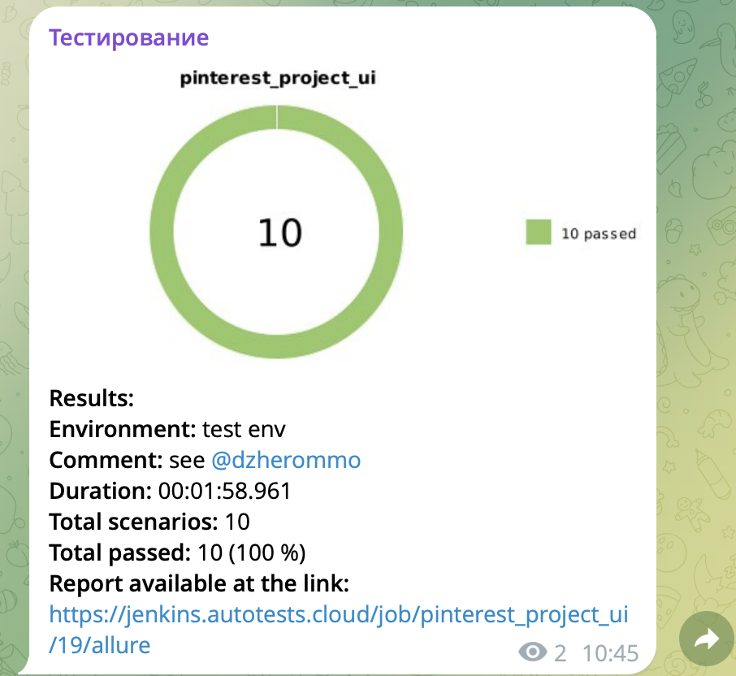

<h1 align="center"> Demo project to automate UI testing for service <a href="https://www.pinterest.com">Pinterest</h1>
<div align="center">
  <a href="https://www.pinterest.com"></a>
</div>
  
> Pinterest is social Internet service, photo hosting, allowing users to add images online, place them in thematic collections and share them with other users.

# :open_file_folder: <a name="TableOfContents">Table of contents</a>

* <a href="#Description">Description</a>
* <a href="#Technology">Tools and technologies</a>
* <a href="#HowToRun">How to run</a>
* <a href="#AllureReport">Test results report in Allure Report</a>
* <a href="#AllureTestOps">Allure TestOps integration</a>
* <a href="#Jira">Jira integration</a>
* <a href="#Telegram">Telegram Notifications</a>
* <a href="#Selenoid">Video of running tests in Selenoid</a>

<a id="Description"></a>
# :bulb: Description
The test project consists of Web tests.\
A brief list of interesting facts about the project:
- [x] `Page Object` with steps using `Chain of Invocations`
- [x] Fake data generating with `Faker` library
- [x] Parametrized tests
- [x] Different configuration files for test running depending on build parameters
- [x] Config with `Owner` library
- [x] `Allure TestOps` integration
- [x] `Jenkins` runs tests
- [x] `Jira` integration

<a id="Technology"></a>
# :technologist: Tools and a technologies
<p  align="center">
  <code></code>
  <code></code>
  <code></code>
  <code></code>
  <code></code>
  <code></code>
  <code></code>
  <code></code>
  <code></code>
  <code></code>
  <code></code>
  <code></code>
  <code></code>
</p>

The autotests in this project are written in `Java` using `Selenide` framework.\
`Gradle` - is used as a build automation tool.  \
`JUnit5` - to execute tests.\
`Jenkins` - CI/CD for running tests remotely.\
`Selenoid` - to remote launching browsers in `Docker` containers.\
`Browserstack` - to run mobile tests.\
`Allure Report` - for test results visualisation.\
`Telegram Bot` - for test results notifications.\
`Allure TestOps` - as Test Management System.

<a id="HowToRun"></a>
# :computer: How to run

### Local running tests

```bash
gradle clean test
```

### Remote running tests

```bash
gradle clean test
-Dbrowser=${BROWSER}
-DbrowserVersion=${BROWSER_VERSION}
-DbrowserSize=${BROWSER_SIZE}
-Dremote=${SERVER_REMOTE}
```
###  Running tests in [Jenkins](https://jenkins.autotests.cloud/job/pinterest_project_ui/)

First you need to click on the <code><strong>*Collect with parameters*</strong></code> button and set options. By clicking on the <code><strong>*Collect*</strong></code> button a build will be started.

<p align="center">
  
</p>

After build is completed, in the <code><strong>*Builds history*</strong></code> opposite the build number will appear
the *Allure Report* icon, clicking on which will open the page with the generated html-report.

<a id="AllureReport">
  
##  Test results report in [Allure Report](https://jenkins.autotests.cloud/job/pinterest_project_ui/19/allure/)

<p align="center">
  
</p>
<p align="center">
  
</p>

<a id="AllureTestOPS">
  
##  Integration with [Allure TestOps](https://allure.autotests.cloud/launch/35037)

### Main dashboard

<p align="center">
  
</p>

### Test results

<p align="center">
  
</p>

<a id="Jira">
  
##  Integration with [Jira](https://jira.autotests.cloud/browse/HOMEWORK-1089)

<p align="center">
  
</p>

<a id="Telegram">
  
##  Telegram notifications using a bot
After the build is completed, a special bot created in <code>Telegram</code>, automatically processes and sends a test run report message.

<p align="center">

</p>

<a id="Selenoid">
  
##  Test running example in Selenoid

A video is attached to each test in the report.

<p align="center">
  
</p>

[back to Contents ⬆](#TableOfContents)
